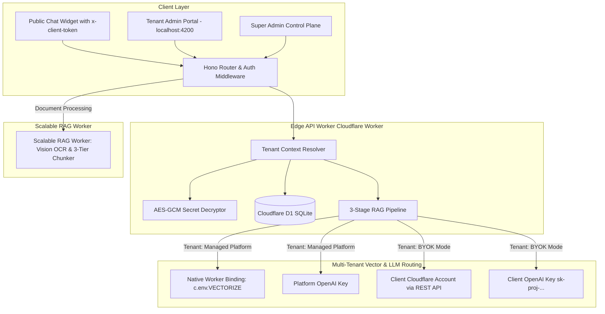

# 🏢 Multi-Tenant SaaS Architecture & Production Deployment Guide

> **Target Branch:** `multitenant-version`  
> **Platform Version:** Enterprise Multi-Tenant SaaS v2.0  
> **Target Audience:** Core Developers, DevOps Engineers, and Infrastructure Architects.

---

## 1. High-Level System Architecture

The platform is designed as an edge-native, multi-tenant SaaS. It allows multiple independent organizations (tenants) to configure their own custom AI personas, upload private documentation, manage conversation history, and optionally **Bring Their Own Cloud Infrastructure (BYOK)** to eliminate platform hosting costs.



---

## 2. Multi-Tenant Isolation Strategy

Every layer of the platform guarantees strict data and compute separation between tenants:

### A. Database Isolation (Cloudflare D1 SQLite)
All primary tables include a `client_id` column indexed for high performance:
- `clients`: Metadata, public token, status (`active`/`suspended`), and billing mode (`platform`/`byok`).
- `client_secrets`: AES-GCM 256-bit encrypted API keys and Cloudflare credentials.
- `auth`: User credentials, scoped by `client_id` and assigned roles (`super_admin` vs `client_admin`).
- `files` & `chunks`: Partitioned by `client_id`. Chunks are query-isolated in SQLite FTS5 lexical searches.
- `threads` & `messages`: Conversations are strictly filtered by `(client_id = ? OR (client_id IS NULL AND ? = 'default'))`.
- `system_settings`: AI persona, company identity, dataset weights, and system prompts per tenant.
- `fallback_queries` & `fallback_clusters`: Unanswered query intelligence is grouped and analyzed strictly per tenant.

### B. Public Widget Authentication (`x-client-token`)
When embedding the chatbot widget on an external site:
```html
<script 
  src="https://your-domain.com/widget.js" 
  data-token="pk_live_37ad4398fef24f09b644bb699e3dfc9a"
  defer>
</script>
```
The public token (`pk_live_...`) is looked up in the `clients` table:
1. Validates the client status (`active`).
2. Extracts the `client_id`.
3. Resolves the tenant's AI Persona, dataset toggles, and LLM configuration.
4. If invalid or suspended, rejects requests with `401 Unauthorized`.

---

## 3. BYOK (Bring Your Own Key) Engine

### A. Cryptographic Security (AES-GCM 256-bit)
Tenant credentials are never stored in plaintext. When a Super Admin registers or updates a BYOK client:
1. A unique 12-byte Initialization Vector (`IV`) is generated for each secret.
2. The key is encrypted using AES-GCM (256-bit) derived from the platform's `MASTER_ENCRYPTION_KEY`.
3. Stored as Base64 in `client_secrets` table (`openai_api_key_encrypted`, `openai_api_key_iv`, `cf_api_token_encrypted`, `cf_api_token_iv`).
4. At request time, `tenant.service.ts` decrypts secrets in-memory inside the isolated V8 Worker execution context.

### B. Dynamic Cloudflare Vectorize REST Router
When `client.billing_mode === 'byok'` and Cloudflare credentials are provided:
- **Zero Vector Platform Consumption:** Vector insertions, similarity searches, and deletions are routed through Cloudflare's Vectorize v2 REST API (`cloudflare-vectorize-rest.service.ts`) directly into the **client's private Cloudflare account**.
- **Auto-Index Provisioning:** If the client's account does not have `chatbot-vector-index` created yet, the server detects the `404` and automatically calls `POST /client/v4/accounts/{accountId}/vectorize/v2/indexes` with `{ name: "chatbot-vector-index", config: { dimensions: 1536, metric: "cosine" } }`, waits for edge propagation, and inserts the vectors with 0 manual setup required from the client.

---

## 4. Roles & Access Control

| Role | Capabilities | Access Path |
| :--- | :--- | :--- |
| **`super_admin`** | Manage all businesses, register new clients, update BYOK secrets, switch between tenant workspaces, view global platform statistics. | `/dashboard/super-admin/*` |
| **`client_admin`** | Manage their own business documents, view conversation threads, inspect fallback intelligence, adjust AI persona. Blocked from super admin pages via `SuperAdminGuard`. | `/dashboard/*` (Tenant Workspace) |

---

## 5. Production Deployment Guide

Follow these steps to deploy the complete multi-tenant platform to production on Cloudflare:

### Step 1: Set Platform Secrets in Cloudflare Workers

Run these commands in the root directory:
```bash
# 1. Master Encryption Key for BYOK Secrets (must be a strong 32+ char secret)
npx wrangler secret put MASTER_ENCRYPTION_KEY

# 2. JWT Signing Secret for Admin Authentication
npx wrangler secret put JWT_SECRET

# 3. Platform Host OpenAI API Key (Fallback for platform-billed tenants)
npx wrangler secret put OPENAI_API_KEY

# 4. Super Admin Initial Password
npx wrangler secret put ADMIN_API_KEY
```

### Step 2: Apply D1 Database Migrations

Apply all schema migrations to your remote Cloudflare D1 database:
```bash
# Apply all 17 migrations to production D1
npx wrangler d1 migrations apply chatbot-db --remote
```

### Step 3: Deploy Backend Worker API

```bash
npx wrangler deploy
```

### Step 4: Deploy Scalable RAG Microservice

```bash
cd scalable-rag
npx wrangler secret put OPENAI_API_KEY
npx wrangler deploy
cd ..
```

### Step 5: Deploy Angular Admin Portal to Cloudflare Pages

1. Update `chatbot-admin-v1/src/environments/environment.prod.ts` with your production Worker URL:
```typescript
export const environment = {
  production: true,
  apiUrl: "https://your-api-worker.workers.dev",
};
```

2. Build the Angular project:
```bash
cd chatbot-admin-v1
npm run build -- --configuration production
```

3. Deploy the build artifacts (`dist/`) to Cloudflare Pages:
```bash
npx wrangler pages deploy dist/ --project-name chatbot-admin
cd ..
```

---

## 6. Verifying Production Deployment

1. Open your production Cloudflare Pages URL.
2. Login with initial Super Admin credentials (`admin` / password configured in D1 seed).
3. Navigate to **Super Admin** $\rightarrow$ **Register Business**.
4. Register a client with **Bring Your Own Key (BYOK)**, enter their OpenAI Key and Cloudflare credentials.
5. Log into the new client account, upload a test PDF/text document, and verify that the vector index is automatically populated in their Cloudflare account under **Workers & Pages $\rightarrow$ Vectorize**.
